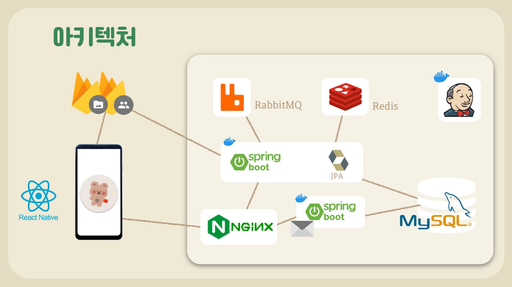

# 🍎사과나무 추억걸렸네🍏

# 📰 프로젝트 개요

**친구들과 재미있게 타임캡슐을 만들어 보세요!**
   
추억에는 그때의 생각과 메시지가 있기 마련입니다.   사과에 소중한 추억을 담아 풍성한 사과나무를 만들어 보세요.   약속된 시간이 되면 친구들과 같이 사과를 따서 추억을 꺼내어 보아요.

 

# 🗓️ 개발기간

**2022.10.11 ~ 2022.11.18 (6주)**

 

# 📽️ UCC

[UCC 바로가기](https://www.youtube.com/watch?v=KiL8vpJiV0E)   

 

# 🌟 Team

|     Name     |                      김낙현                      |                     송선아                      |                     송제영                      |                     이예은                      |                   조다연                   |                     차송희                      |
| :----------: | :----------------------------------------------: | :---------------------------------------------: | :---------------------------------------------: | :---------------------------------------------: | :----------------------------------------: | :---------------------------------------------: |
| **Profile**  |   |  |  |  |  |  |
| **Position** |               Infra FullStack               |                    FullStack                    |            Team Leader Backend             |                    FullStack                    |            Frontend  UI/UX            |          Frontend UI/UX UCC           |
|   **Git**    | [@Psalmist-KIM](https://github.com/Psalmist-KIM) |     [@Seona98](https://github.com/seona98)      |   [@hooreique](https://github.com/hooreique)    |       [@lye2i](https://github.com/lye2i)        |   [@dus6982](https://github.com/dus6982)   |  [@chasonghui](https://github.com/chasonghui)   |

 

# 🛠️ 기술스택

| Tech         | Stack                                        |
| ------------ | -------------------------------------------- |
| **Backend**  | Java, Spring Boot, JPA, RabbitMQ             |
| **Frontend** | React-Native                                 |
| **DataBase** | MySQL, Redis                                 |
| **Tools**    | AWS EC2, Firebase Auth, Firebase Storage, NginX, Docker, GitLab, JIRA, Notion |

 

# 📌 시스템 아키텍처

 

## 🗃️ ERD

 

# 🔎 주요 기능

### 1. 메인 화면

| 사과가 없는 경우                                                                                                               | 사과가 있는 경우                                                                                            | 잠긴사과 모달                                                                                               |
| ------------------------------------------------------------------------------------------------------------------------------ | ----------------------------------------------------------------------------------------------------------- | ----------------------------------------------------------------------------------------------------------- |
|  |  |  |

### 2. 사과 만들기

- 세션 생성 및 입장
  | 세션 생성 | 세션 입장 | 세션 코드 복사 |
  | ----------------------------------------------------------------------------------------- | ----------------------------------------------------------------------- | ------------------------------------------------------------------------------------------------------------ |
  |  |  |  |

- DB에 사과 넣기
  | 사과에 추억 담기 | 녹음폼 | 사진 및 동영상 넣기 |
  | ----------------------------------------------------------------------------------------- | ----------------------------------------------------------------------- | ------------------------------------------------------------------------------------------------------------ |
  |  |  |  |

### 3. 사과 리스트 보기

| 사과가 없는 경우                                                                          | 열린 사과 목록                                                                                              | 잠김 사과 목록                                                                                              |
| ----------------------------------------------------------------------------------------- | ----------------------------------------------------------------------------------------------------------- | ----------------------------------------------------------------------------------------------------------- |
|  |  |  |

### 4. 사과 따기

- 세션 입장 (사과 때리기)
   
  

### 5. 사과 상세보기

- 잠긴사과 상세보기
   
  

- 열린사과 상세보기
  | 열린사과 상세보기 | 씨앗 상세보기 | 씨앗 상세보기-다운로드 |
  | ----------------------------------------------------------------------------------------- | ----------------------------------------------------------------------------------------------------------- | ----------------------------------------------------------------------------------------------------------- |
  |  |  |  |

### 6. 이메일 전송

- 이메일 전송

  

### 7. 지도 보기

- 만든 사과 위치 표시

    

### 8. 마이 페이지

- 마이페이지

  

 

## 시연영상

[시연영상 바로가기](https://www.youtube.com/watch?v=9pNwGHzRI6g)

 

## 🔗 WIKI

📖 [Team Notion](https://chasonghui.notion.site/1202c1502e9b410ea561ee25ee6ac659)

🙌 [Git Convention](https://chasonghui.notion.site/commit-branch-6119490deff242cc9c4afbf3bbe61aa3)

📜 [API 명세서](https://chasonghui.notion.site/API-f71b36093160458694ac36cb2cf62ed1) | [FIGMA](https://www.figma.com/file/0xazrudv5SUGJREIuPYF4V/%EC%82%AC%EA%B3%BC%EB%82%98%EB%AC%B4%EC%B6%94%EC%96%B5%EA%B1%B8%EB%A0%B8%EB%84%A4?node-id=0%3A1)

 
