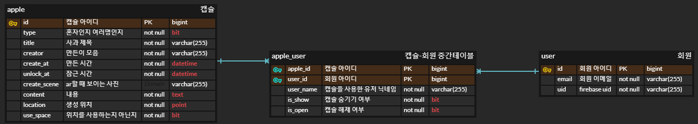

# 🍎사과나무 추억걸렸네🍏 

# 📰 프로젝트 개요 

**친구들과 재미있게 타임캡슐을 만들어 보세요!**
   
추억에는 그때의 생각과 메시지가 있기 마련입니다.   사과에 소중한 추억을 담아 풍성한 사과나무를 만들어 보세요.   약속된 시간이 되면 친구들과 같이 사과를 따서 추억을 꺼내어 보아요.

 

# 🗓️ 개발기간

**2022.10.11 ~ 2022.11.18 (6주)**

 

# 📽️ UCC  (예정)

 

# 🌟 Team

|     Name     |                          김낙현                           |                          송선아                           |                            송제영                            |                          이예은                           |                 조다연                 |                          차송희                           |
| :----------: | :-------------------------------------------------------: | :-------------------------------------------------------: | :----------------------------------------------------------: | :-------------------------------------------------------: | :------------------------------------: | :-------------------------------------------------------: |
| **Profile**  |  |  |  |  |   |  |
| **Position** |                   Infra FullStack                    |                         FullStack                         |                   Team Leader Backend                   |                         FullStack                         |          Frontend  UI/UX          |               Frontend UI/UX UCC                |
|   **Git**    |     [@Psalmist-KIM](https://github.com/Psalmist-KIM)      |          [@Seona98](https://github.com/seona98)           |          [@hooreique](https://github.com/hooreique)          |            [@lye2i](https://github.com/lye2i)             | [@dus6982](https://github.com/dus6982) |       [@chasonghui](https://github.com/chasonghui)        |

 

#  🛠️ 기술스택

| Tech         | Stack                                        |
| ------------ | -------------------------------------------- |
| **Backend**  | Java, Spring Boot, JPA, JWT                  |
| **Frontend** | React-Native                                 |
| **DataBase** | MySQL, Redis, Firebase                       |
| **Tools**    | AWS EC2, NginX, Docker, GitLab, JIRA, Notion |

 

# 📌 시스템 아키텍처    

(사진 추가 예정)

 

## 🗃️ ERD

 

# 🔎 주요 기능    

#### 1. 사과 만들기

 - 세션 생성 및 입장
 - DB에 사과 넣기

#### 2. 사과 리스트 보기

 - 열린 사과
 - 잠긴 사과

#### 3. 사과 따기

 - 세션 입장 (사과 때리기)      

#### 4. 사과 상세보기

#### 5. 지도 보기

 - 만든 사과 위치 표시

#### 6. 메인 화면 및 마이 페이지   

 

## 🔗 WIKI 

📖 [Team Notion](https://chasonghui.notion.site/1202c1502e9b410ea561ee25ee6ac659)

🙌 [Git Convention](https://chasonghui.notion.site/commit-branch-6119490deff242cc9c4afbf3bbe61aa3)

📜 [API 명세서](https://chasonghui.notion.site/API-f71b36093160458694ac36cb2cf62ed1) | [FIGMA](https://www.figma.com/file/0xazrudv5SUGJREIuPYF4V/%EC%82%AC%EA%B3%BC%EB%82%98%EB%AC%B4%EC%B6%94%EC%96%B5%EA%B1%B8%EB%A0%B8%EB%84%A4?node-id=0%3A1)

   
 

## ⚙️ 배포 관련 

🔧 [EC2 원격설정]()

💡 [자동배포 가이드]()
